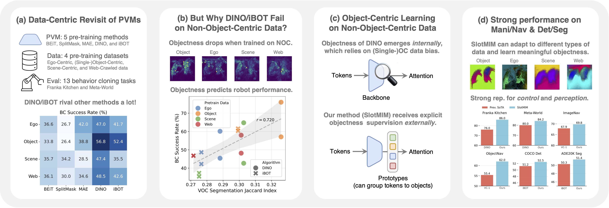

# A Data-Centric Revisit of Pre-Trained Vision Models for Robot Learning

<p align="center">
    
    <a href="https://arxiv.org/abs/2205.15288"></a>
    <a href="https://connecthkuhk-my.sharepoint.com/:f:/g/personal/xwen_connect_hku_hk/Eh8V7igWRhpBtFndEDRwYSgBKbo-tw4ZdkRdSt0hNTiPBQ?e=qx9b9c"></a>
  <a href="https://github.com/CVMI-Lab/SlotMIM/blob/main/LICENSE"></a>
</p>
<p align="center">
	A Data-Centric Revisit of Pre-Trained Vision Models for Robot Learning (CVPR 2025)<br>
  By
  <a href="https://wen-xin.info">Xin Wen</a>, 
  <a href="https://bzhao.me/">Bingchen Zhao</a>, 
  <a href="https://yilunchen.com/about/">Yilun Chen</a>, 
  <a href="https://oceanpang.github.io/">Jiangmiao Pang</a>, and 
  <a href="https://xjqi.github.io/">Xiaojuan Qi</a>.
</p>

## Introduction



**An overview of this paper.** (a) We conduct a comprehensive study evaluating pre-trained vision models (PVMs) on visuomotor control and perception tasks, analyzing how different pretraining (model, data) combinations affect performance. Our analysis reveals that DINO/iBOT excels while MAE underperforms.
(b) We investigate the performance drop of DINO/iBOT when trained on non-(single-)object-centric (NOC) data, discovering they struggle to learn objectness from NOC data—a capability that strongly correlates with robot manipulation performance.
(c) We introduce SlotMIM, which incorporates explicit objectness guidance during training to effectively learn object-centric representations from NOC data.
(d) Through scaled-up pre-training and evaluation across six tasks, we demonstrate that SlotMIM adaptively learns different types of objectness based on the pre-training dataset characteristics, outperforming existing methods.


## Getting started

### Requirements

The following is an example of setting up the experimental environment:

* Create the environment
```shell script
conda create -n slotmim python=3.9 -y
conda activate slotmim
```

* Install pytorch & torchvision (you can also pick your favorite version)
```shell script
conda install pytorch==2.2.0 torchvision==0.17.0 torchaudio==2.2.0 pytorch-cuda=12.1 -c pytorch -c nvidia
```

* Clone our repo
```shell script
git clone https://github.com/CVMI-Lab/SlotMIM && cd ./SlotMIM
```

* (Optional) Create a soft link for the datasets
```shell script
mkdir datasets
ln -s ${PATH_TO_COCO} ./datasets/coco
ln -s ${PATH_TO_IMAGENET} ./datasets/imagenet
```


At this stage, we have provided the code for pre-training SlotMIM, and evaluation scripts for object discovery, classification, object detection, and segmentation. For training please check [./scripts/](./scripts/), and for evaluation please check [./transfer/](./transfer/) and [eval_voc.py](eval_voc.py) and [eval_knn.py](eval_knn.py). We also have released pre-trained checkpoints of our model and other re-implemented baselines [here](https://connecthkuhk-my.sharepoint.com/:f:/g/personal/xwen_connect_hku_hk/Eh8V7igWRhpBtFndEDRwYSgBKbo-tw4ZdkRdSt0hNTiPBQ?e=qx9b9c).
Please feel free to explore them for now and we will continue to update the readme with more instructions, and integrate evaluation scripts for robotics tasks in the future.


## Citing this work

If you find this repo useful for your research, please consider citing our paper:

```
@inproceedings{wen2025slotmim,
  title={A Data-Centric Revisit of Pre-Trained Vision Models for Robot Learning},
  author={Wen, Xin and Zhao, Bingchen and Chen, Yilun and Pang, Jiangmiao and Qi, Xiaojuan},
  booktitle={CVPR},
  year={2025}
}
```

## Acknowledgment

Our codebase builds upon several existing publicly available codes. Specifically, we have modified and integrated the following repos into this project: [iBOT](https://github.com/bytedance/ibot/tree/main), [MAE](https://github.com/facebookresearch/mae), [SlotCon](https://github.com/CVMI-Lab/SlotCon), [PixPro](https://github.com/zdaxie/PixPro), [DINO](https://github.com/facebookresearch/dino), and [Slot Attention](https://github.com/google-research/google-research/tree/master/slot_attention).

## License
This project is licensed under the Apache License 2.0 - see the [LICENSE](LICENSE) file for details.